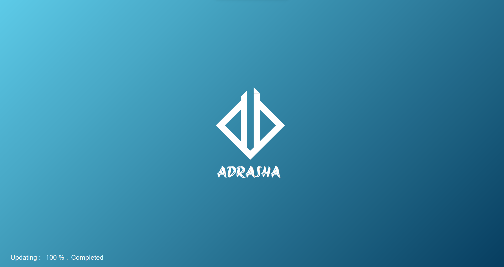
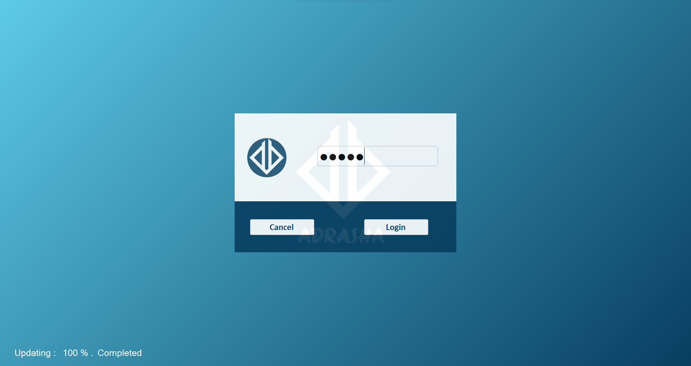
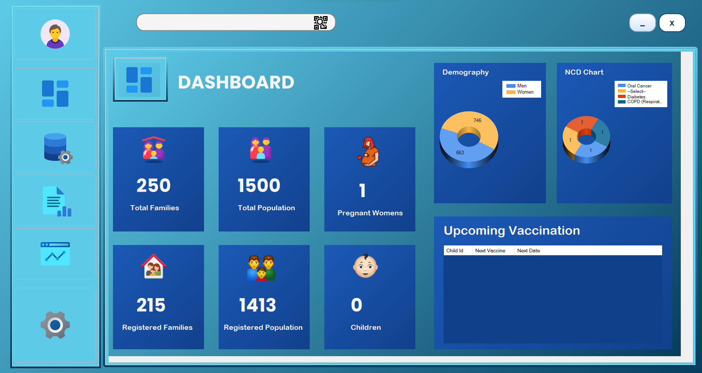

# Documentation
### Project **ADRASHA** - Alternative Digital Registry for ASHA
    Thanks for your help and support:
        Rutik Kale
        Madhav Mane
        Atharv Yadav
        Krypton Suit
    By :
        Gaurav Jadhav
        Kiran Ghorpade

### Words Used in Documentation
    ADRASHA - Alternative Digital Registry for Accredited Health Activists (Project Name)

    ASHA - Accredited Health Activists
    (Volunteers Involve in National Health Mission)

    Krypton Suite - (Open source) .NET Winfroms controls for C# winform 

### Short Summary

    The "ADRASHA Desktop Prototype" is Final Year Project for Bachelor of Computer Science Course of Shivaji University. It is a software solution which is an alternative solution to the repetitive written work of ASHA’s general registry. The ADRASHA will provide an effective way to manage the Accredited Social Health Activist program in India. The system will automate various processes, reducing the workload of ASHA and improving the efficiency of the program. The system will also provide a more accurate way of tracking and monitoring beneficiaries, ensuring that they receive the necessary healthcare services.

### Introduction -

    The Accredited Social Health Activities (ASHA) program in India is a crucial initiative that aims to improve the health outcomes of underprivileged communities, especially mothers and children. However, the success of the program largely depends on the timely and     accurate collection of data from the field, which is often a manual and time-consuming process.

    To address this challenge, this project proposes to develop Digital System that will enable ASHAs to collect and submit data in application, 
    which will facilitate quicker decision-making by ASHA through analyzed data. 

    The ADRASHA (a short for Alternative Digital Registry for ASHA.) is a software solution which is alternative to the repetitive written work of ASHA’s general registry. The ADRASHA will provide an effective way to manage the Accredited Social Health Activist           program in India. The system will automate various processes, reducing the workload of ASHA and improving the efficiency of the program. The system will also provide a more accurate way of tracking and monitoring beneficiaries, ensuring that they receive the          necessary healthcare services on time. 

    The Motive of project to help improve the healthcare services provided to underprivileged communities in India with digital way, thereby contributing to the overall improvement of healthcare in the country.
    The system is designed with a user-friendly interface that will allow ASHA workers to easily navigate through different modules.

### About ADRASHA Desktop Prototype

    ADRASHA System is consist of integrated modules with different platform to work together like webapps, native applications, servers to create a whole digital ecosystem.

    "ADRASHA Desktop Prototype" is our college project which demonstrate the idea of client application features on desktop environment. It uses .NET Framework's C# Winforms to create User Interface with Krypton Suite of .NET Winforms controls (Open source UI             controls suite for C# winform).

### Technologies Used

    .NET Framework 4.8.1
    Microsoft Reporting Techology
    SQLite 3

    to be update...

### USER MANUAL

    First when you visit to a Desktop Prototype You will find -

---
1. Splash Page

        Updates All Members Data w.r.t. current date.
    
---
2. Registration Form

        ⤴️ This Page appear if you opening application first time.
    
---
3. Set Security

        ⤴️ This Page appear if you opening application first time.
    
---
4. Login

        Authenticate Yourself
    
---
5. Dashboard Page

        This is the First page of Software
        At this UI You will find following menus.
    
    ---    
    1. Profile 

            Information of Asha and Village
        
    ---
    2. Dashboard

            Quick Numbers of Village and Upcoming Vaccination information
        
    ---
    3. Registry

            Quick navigation to details of all members
        
        ---
        1. Add new Family

                Easy way to add new family
            
        ---
        2. Add Head Info

                After adding Family, you have to add Family Head Information
            
        ---
        3. Open Family Profile

                After Adding Family, you can see Family Profile in Registry.
            
            ---
            1. Add new Member 
                    
                    You can add new member to a family
                
            ---
            2. Health Profile

                    Health Profile shows Health Info in Brief.
                
                ---
                1. Member Profile

                        This shows personal information about family member.
                   
                ---
                2. Vaccination Profile
                        
                        This shows Vaccination Details of child
                   
                ---
                3. HBNC

                        This Shows various visits of HBNC
                   
                ---
                4. Maternal Health

                        This Shows Maternal and Pregnancy Details
                   
                   
                        This Shows Maternal Visits
                   

                ---
                5. NCD And CBAC Forms

                        you can add NCD visits and fill CBAC forms.
                    
---
6. Report

        ---
    
    ---
    1. Generate New Report
        
            ---
        
    ---
    2. Reports Template
    
            ---
        
        ---

    1. Reports Generation
            
            After selecting Template, it generates reports and you can save it as pdf.
        
    ---
    3. Saved Reports

            ---
        
    ---
    4. Reports Viewer

            ---
        
    ---
10. Analytics

        ---
    
---
11. Setting

        ---
    
---
12. Search Bar

        ---
    

    1. QR Based Search 

            ---
        
    
